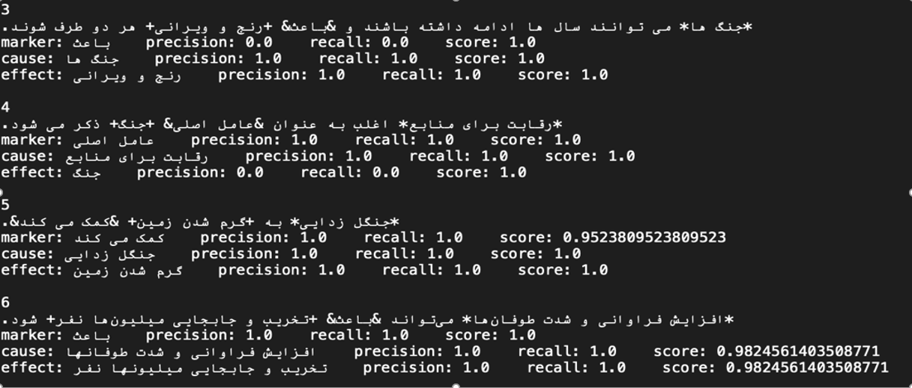

# CAUSALITY DETECTION IN PERSIAN EXPRESSIONS
[Causality](https://en.wikipedia.org/wiki/Causality) (also called causation, or cause and effect) is the influence by which one event, process, state, or object (a cause) contributes to the production of another event, process, state, or object (an effect) where the cause is partly responsible for the effect, and the effect is partly dependent on the cause. 

Causality occur in the following different forms in natural language.

**Explicit vs Implicit**

In contrast to explicit causality, a deeper understanding of the particular event is needed for implicit causality. 

> "او بسیار زیاد سیگار می‌کشید. او سرطان گرفت."

In this example, we suspect that the person got cancer because of his smoking habit, however it is not explicitly stated.

> "او سرطان گرفت **چون** زیاد سیگار می‌کشید."

This example explicitly states the cause and the effect.

**Marked vs Unmarked**

Marked causality always has a linguistic unit which indicates the causality, where as unmarked causality does not have any.

In this project, we try to detect cause and effect in Persian expressions, to do so, we considered several approaches that will be explained in following section. 

## Project contents
The contents of this project are available in the data and source folder. In the data folder, all the data extracted and used in this project are given. In the source folder, you can find the codes related to the demo project, data preprocessing, and notebooks corresponding to each model.

### Data
One of the data sources used is the contents of [Persian Wikipedia](https://fa.wikipedia.org/wiki/%D8%B5%D9%81%D8%AD%D9%87%D9%94_%D8%A7%D8%B5%D9%84%DB%8C). Keywords appropriate to this field have been used to extract causal relationships. To extract possible sentences of cause and effect, sentences are first extracted from the existing texts and then the sentences containing the mentioned sentences are extracted for manual labeling.

Also, other source of data had used in this project, such as [PERLEX Dataset](http://farsbase.net/download/PERLEX.zip), [Causal-Bank Dataset](https://nlp.jhu.edu/causalbank/), [Causality corpus data of natural language processing laboratory of Shahid Beheshti University](http://nlp.sbu.ac.ir/), Data creation with ChatGPT.

Aggregation of labeled data for Bert, FastText, and NER models are found in samples.out.txt file. In this data, ✹Cause✹ - ✹✹Marker✹✹ - ✹✹✹Effect✹✹✹ used for initial labeling.

### Modeling Approaches
We implement 4 models to detect cause-effect relations and due to their base core we name them as follow: Bert - Fasttext - NER - Extractive Q&A

It is needed to note that the criteria provided for evaluating the methods are given in the notebooks themselves, however, mostly what is declared as accuracy is the accuracy of correctly predicting the tokens.

#### (1) Bert - notebook: [Cause_Effect_Detection_BERT](https://github.com/Amin-Saeidi/NLP_CausalDetection/blob/main/src/notebook/Cause_Effect_Detection_BERT.ipynb) 
This model will focus on unmarked causality, and only will specifiy the cause and effect.

**Summary of model:**

Bert model is an efficient language model based on transformer architecture. In this model, the context-based representation of words is used. One of the advantages of this model is the use of the multi-head attention mechanism to check the attention level of the phrases of a text. To solve the problem of extracting cause and effect relationships, a Bert feature has been used in the problem of token classification. In this model of 12 layers, each layer contains: BertAttention - BertSelfOutput - BertIntermediate - BertOutput

In the last layer, a classification network is used to recognize word tags. The input dimension of this peeler is the representation of words in Burt's model, and the output dimension is the number of word tags. The tags are as follows:

O: other words

B-CAUSE: The beginning of the cause

I-CAUSE: the middle word of cause

B-EFFECT: the beginning of the cause

I- EFFECT: the middle word of cause

**sample output:**

#### (2) Fasttext - notebook: [Cause_Effect_Detection_Fasttext](https://github.com/Amin-Saeidi/NLP_CausalDetection/blob/main/src/notebook/Cause_Effect_Detection_Fasttext.ipynb)
This model will focus on marked causality, and only will specifiy the cause and effect and also marker.

**Summary of model:**

For this implementation, after normalization and tokenization, they are embedded with the help of fasttext, and also the model of this implementation is a one-layer and one-way lstm network. The Tags are as follows:

n: other words

c: Cause

e: Effect

m: marker

**sample output:**

#### (3) NER - notebook: [Cause_Effect_Detection_NER](https://github.com/Amin-Saeidi/NLP_CausalDetection/blob/main/src/notebook/Cause_Effect_Detection_NER.ipynb)
This model will focus on marked causality, and only will specifiy the cause and effect and also marker.

**Summary of model:**

This note book implements the standard Named Entity Recogntion using Tensorflow, The model architecture uses standard Embedding Layer,GRU Layer,TimeDistributed Layer and SpatialDropout Layer for regularization. The Tags are as follows:

none: other words

c: Cause

e: Effect

m: marker

**sample output:**

#### (4) Extractive Q&A - notebook: [Cause_Effect_Detection_With Question-Answering Model](https://github.com/Amin-Saeidi/NLP_CausalDetection/blob/main/QA/QA_notebook.ipynb)

**Summary of model:**

In this method, the well-known problem of question and answer has been used to learn and find the cause, effect and marker. In general, in this question and answer model, a text is presented to us and we have to find the answer based on it. This model contains three models:

The first model's goal is to find the causal marker given the sentence.

The second model's goal is to find the cause given the marker and the sentence.

The third model's goal is to find the effect give the marker and the sentence.

**sample output:**

### Demo
The demo of this project is written using the PyWebIO Python library. You can see a video of this demo in [Video_example of demo](https://drive.google.com/drive/folders/1cin_qH-_LkSz6GHZrSz5G8Wh_ZVm4BK8?usp=sharing)

## Usage
The implementation of the models mentioned in the previous section are all available in 4 separate notebooks in the project files. All the dependencies needed to run these notebooks are included and it is enough to run the cells in order. It should be noted that for the correct implementation of each model, it is necessary that the paths given in each notebook for reading data and saving the model must be changed by the user.

## Contributing
Pull requests are welcome. For major changes, please open an issue first
to discuss what you would like to change.

## Team
[HamidReze Akbari](https://github.com/hakbari14) | [Amin Saeidi](https://github.com/amin-saeidi) | [Zahra Fazli](https://github.com/mohamadassadeq) | [Alireza Moslemi Haghighi](https://github.com/AAstroA) | [Mahdi Farahbakhsh](https://github.com/mahdi124710)

## License
[MIT](https://choosealicense.com/licenses/mit/)
